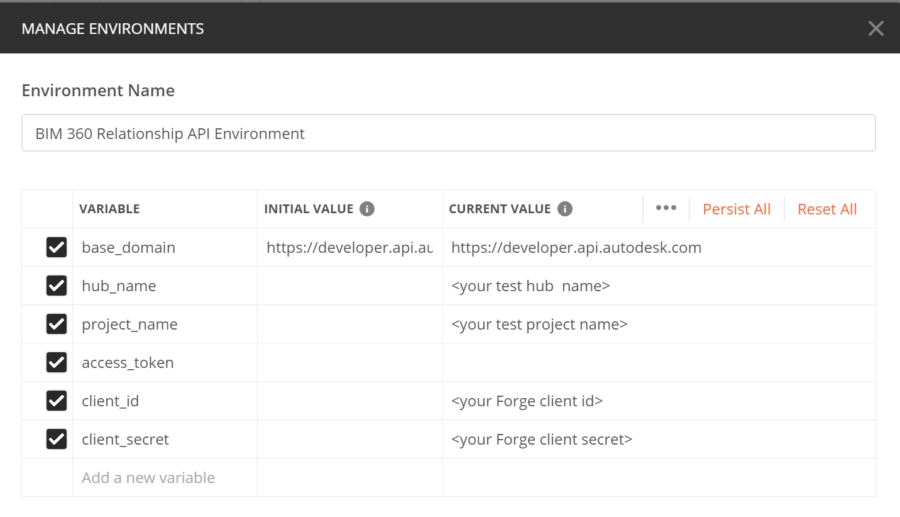
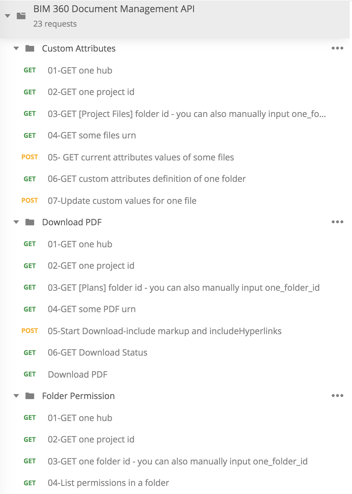
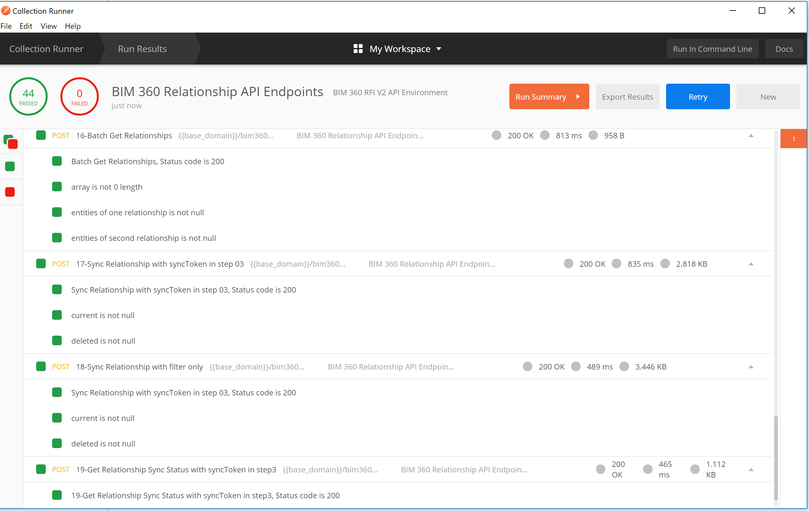

# Postman Collection for BIM360 or ACC Document Management API 

[](https://www.getpostman.com/)


[](http://opensource.org/licenses/MIT)

## Description

This repository provides demos for the category of [BIM360 or ACC Document Management (Docs) API](https://forge.autodesk.com/en/docs/bim360/v1/reference/http/document-management-projects-project_id-versions-version_id-exports-POST/). These APIs are compatible with ACC and BIM360. Right now, the APIs demos are:
 - Custom Attributes
 - Folder Permissions
 - Download PDF
 
As to Get Documents/Items/Versions/Objects, they belong to Data Management APIs. This collection does not include them.

These APIs support both application context authentication (2-legged token) and user context authentication (3-legged token)

## What's Postman?

Postman is a popular tool that provides an easy-to-use interface to send HTTP requests. Postman is able to parse the responses that Forge sends you and save response parameter values to variables. These parameters can then be reused in subsequent requests through these variables. The Postman collections in this repository use this ability to provide pre-populated HTTP requests to help you follow the tutorial workflow with minimal effort. You can also modify the requests and experiment without having to write a single line of code. 

- You can learn how to install and use Postman from [here](https://learning.getpostman.com/docs/postman/launching_postman/installation_and_updates).

- You can download the Postman installer from [here](https://www.getpostman.com/downloads/).


## Setup

1.  **APS Account**: Learn how to create a APS Account, activate the subscription and create an app by [this tutorial](https://get-started.aps.autodesk.com/). Get APS _client id_, _client secret_ and  _callback url_. Please register APS app with the _callback url_ as below. This is for the workflow of user context authentication (3-legged token)

    ```https://www.getpostman.com/oauth2/callback```

2. **Provision your APS app to BIM 360 or ACC Account**: must be Account Admin to add the app integration. [Learn about provisioning](https://get-started.aps.autodesk.com/#provision-access-in-other-products). Make a note with the __account name__

3. Ensure test project exists. Make a note with the __project name__ .

4.  Clone this repository or download it. It's recommended to install [GitHub Desktop](https://desktop.github.com/). To clone it via command line, use the following (**Terminal** on MacOSX/Linux, **Git Shell** on Windows):

    ```git clone https://github.com/xiaodongliang/forge-bim360.relationship.api-postman.collection```

5. Import the collection and environment files to Postman

6. In environment, input _client id_, _client secret_, _hub name_ with __account name__, and _project name_ as __project name__

   <p align="center"></p>  

## Generate Token

This collection takes **[Inheriting auth](https://learning.getpostman.com/docs/postman/sending-api-requests/authorization/#inheriting-auth)** to apply token to every endpoint in the collection automatically, which means it does not need to input the token in the header explicitly. 

### 2-legged token scenario
   Run the script **GET 2Legged Token**. It will return the access token for working with other API calls. 

### 3-legged token scenario
   In context menu of collection >> **Edit**, switch to the tab **Authorization**. switch type to **OAuth 2.0**. Input the variables in __Configure New Token__.  **Get New Access Token**, and **Update**

   - Grant Type ``Authorization Code``
   - Callback URL  ``https://www.getpostman.com/oauth2/callback``
   - Auth URL  ``https://developer.api.autodesk.com/authentication/v2/authorize``
   - Access Token URL  ``https://developer.api.autodesk.com/authentication/v2/token``
   - Client ID ``{{client_id}}``
   - Client Secret ``{{client_secret}}``
   - Scope ``data:read``
   - Client Authentication ``Send as Basic Auth header``

   Click **Request Token**, it will direct to login Autodesk account, after it succeeds, the token will be generated. Click **Use Token**.  

## API Test

1. Assume the steps of **Setup** have been performed. The access token is ready.

2. Play the scripts. Try to change some parameters or body with more scenarios. 
   <p align="center"></p> 

3. With [Postman Runner](https://learning.postman.com/docs/running-collections/intro-to-collection-runs/), these scripts can be chained to perform auto-test. Check **Tests** tab to define your preferred tests.

   <p align="center"></p> 


## License

This sample is licensed under the terms of the [MIT License](http://opensource.org/licenses/MIT). Please see the [LICENSE](LICENSE) file for full details.

## Written by

Xiaodong Liang [@coldwood](https://twitter.com/coldwood), [Developer Advacacy and Support](http://aps.autodesk.com)
